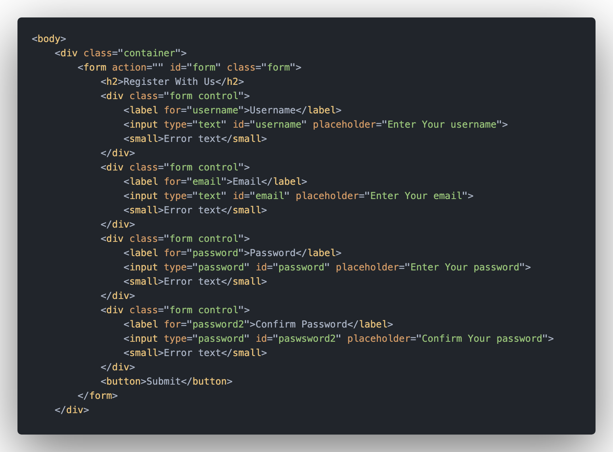

# Vanilla JavaScript Project 001

Client side form validation

## Project Specifications

This form check required, length, email and password match

* Create form UI
* Show error messages under specific inputs
* checkRequired() to accept array of inputs
* checkLength() to check min and max length
* checkEmail() to validate email with regex
* checkPasswordsMatch() to match confirm password

## Instructions:

### Step 1 - Html STRUCTURE

<h2 align="center">
  
</h2>