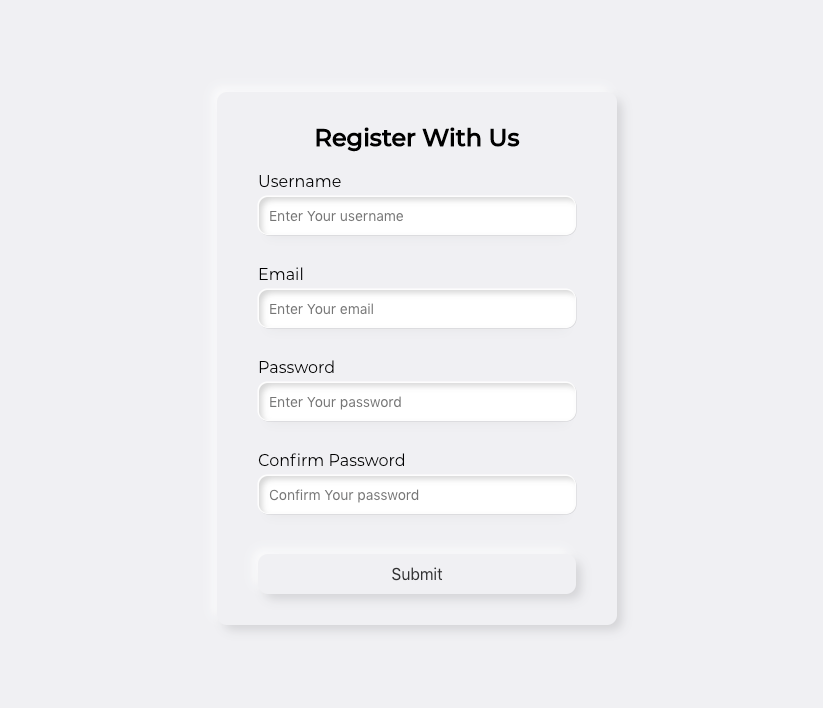
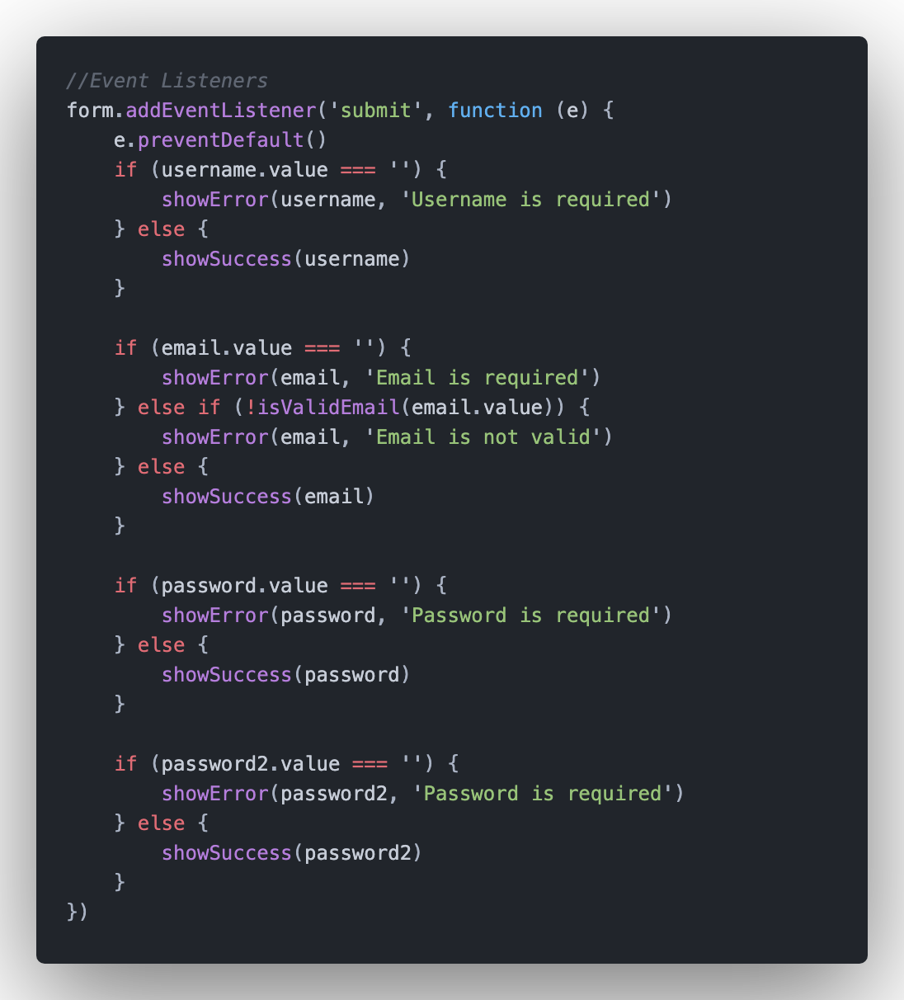

# Vanilla JavaScript Project 001

Client Side Form Validation

## Project Specifications

This form check required, length, email and password match

* Create form UI
* Show error messages under specific inputs
* checkRequired() to accept array of inputs
* checkLength() to check min and max length
* checkEmail() to validate email with regex
* checkPasswordsMatch() to match confirm password

## Step by step building process:

### Step 1 - HTML STRUCTURE

<h2 align="center">
  
</h2>

### Step 2 - CSS STYLE

For most part its pretty basic CSS, I chose for this project neomorphism design

<h2 align="center">
  
</h2>

### Step 3 - JavaScript

Most fun part. Creating basic functions for input and eventListener.

<h2 align="center">
  
</h2>